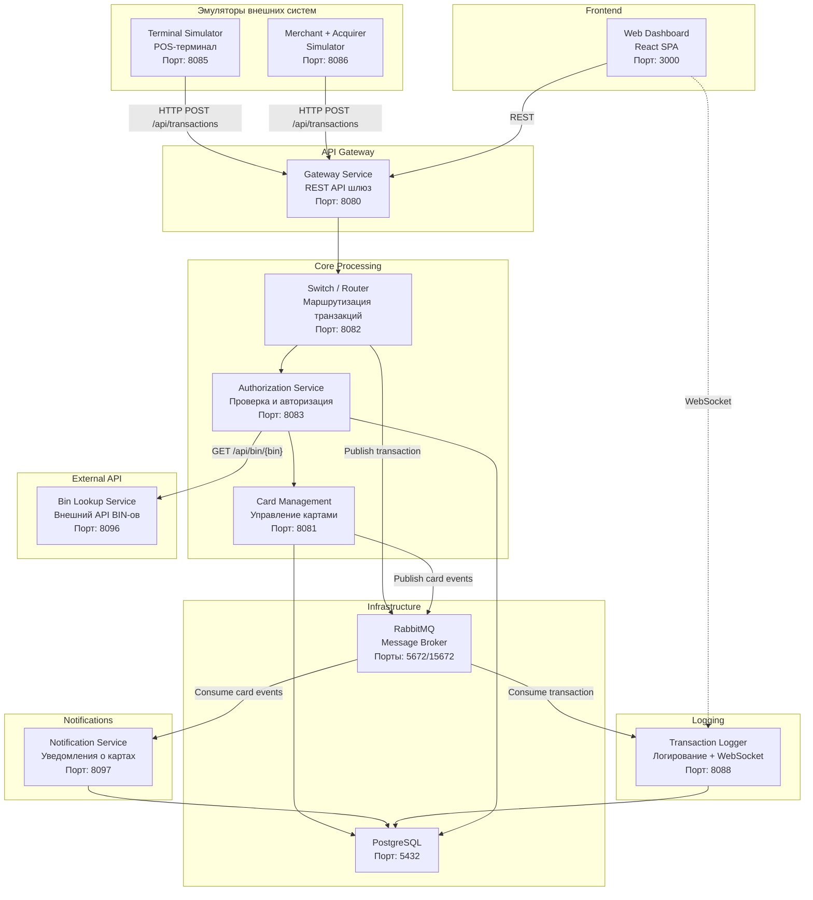
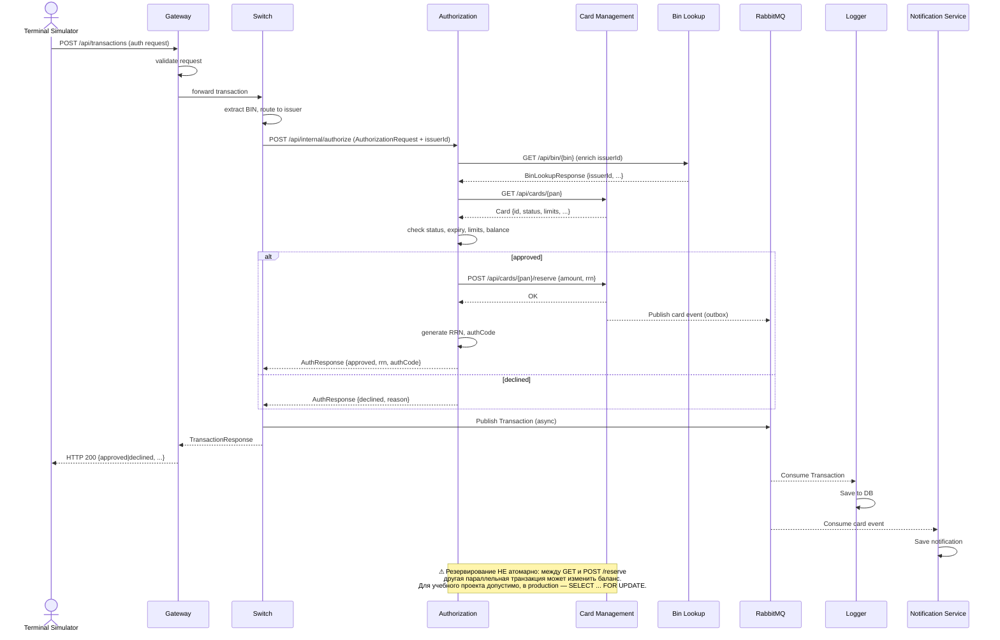

# Архитектура СМП

## Общая схема



---

## Путь транзакции (Sequence Diagram)



---

## Модель данных

### Card (Карта)

| Поле | Тип | Описание |
|------|-----|----------|
| `id` | UUID | Уникальный идентификатор |
| `pan` | String(16) | Номер карты (только «наши» тестовые карты) |
| `bin` | String(6) | BIN (первые 6 цифр PAN) |
| `cardholderName` | String | Имя держателя |
| `expiryDate` | String(4) | Срок действия (MMYY) |
| `status` | Enum | ACTIVE, INACTIVE, BLOCKED, EXPIRED |
| `currencyCode` | String(3) | Код валюты (643 = RUB) |
| `dailyLimit` | BigDecimal | Дневной лимит |
| `monthlyLimit` | BigDecimal | Месячный лимит |
| `availableBalance` | BigDecimal | Доступный остаток |
| `issuerId` | String | ID банка-эмитента |
| `createdAt` | DateTime | Дата создания |

### Transaction (Транзакция)

| Поле | Тип | Описание |
|------|-----|----------|
| `id` | UUID | Уникальный идентификатор |
| `mti` | String(4) | Message Type Indicator (0100/0110) |
| `stan` | String(6) | System Trace Audit Number |
| `rrn` | String(12) | Retrieval Reference Number |
| `pan` | String(16) | Номер карты |
| `processingCode` | String(6) | Код операции (000000 = покупка) |
| `amount` | BigDecimal | Сумма в копейках/центах |
| `currencyCode` | String(3) | Код валюты |
| `terminalId` | String(8) | ID терминала |
| `merchantId` | String(15) | ID мерчанта |
| `mcc` | String(4) | Merchant Category Code |
| `acquirerId` | String | ID эквайрера |
| `issuerId` | String | ID эмитента |
| `status` | Enum | APPROVED, DECLINED |
| `declineReason` | String | Причина отказа |
| `authCode` | String(6) | Код авторизации |
| `transmissionDateTime` | DateTime | Время отправки |
| `createdAt` | DateTime | Время создания записи |

---

## Формат сообщений (упрощённый ISO 8583)

Все сервисы обмениваются JSON-сообщениями. Структура приближена к ISO 8583, но в JSON-формате для удобства.

### Authorization Request (0100)

```json
{
  "mti": "0100",
  "stan": "000001",
  "pan": "4000001234560001",
  "processingCode": "000000",
  "amount": 150000,
  "currencyCode": "643",
  "transmissionDateTime": "2026-06-01T10:30:00Z",
  "terminalId": "TERM001",
  "terminalType": "POS",
  "merchantId": "MERCH12345678901",
  "mcc": "5411",
  "acquirerId": "ACQ001"
}
```

### Authorization Response (0110)

```json
{
  "mti": "0110",
  "stan": "000001",
  "rrn": "012345678901",
  "authCode": "ABC123",
  "responseCode": "00",
  "status": "APPROVED",
  "processingTimeMs": 42
}
```

---

## Порты сервисов

| Сервис | Порт |
|--------|:---:|
| Gateway | 8080 |
| Card Management | 8081 |
| Switch | 8082 |
| Authorization | 8083 |
| Terminal Simulator | 8085 |
| Merchant Simulator | 8086 |
| Transaction Logger | 8088 |
| Bin Lookup | 8096 |
| Notification Service | 8097 |
| Dashboard | 3000 |
| PostgreSQL | 5432 |
| RabbitMQ (AMQP) | 5672 |
| RabbitMQ (Management UI) | 15672 |

---

## Ключевые принципы архитектуры

1. **Только свои карты** — обрабатываются только карты из Card Management. Нет понятия «внешних» BIN.
2. **Гибридное взаимодействие** — сервисы общаются через синхронный HTTP REST и асинхронный RabbitMQ. Логирование транзакций и уведомления — асинхронные; авторизация и резервирование — синхронные.
3. **Единая база данных** — один инстанс PostgreSQL используется сервисами: Card Management (таблица `cards`), Authorization (таблица `limit_usage`), Transaction Logger (таблица `transactions`), Notification Service (таблица `card_notifications`). Остальные сервисы (Gateway, Switch, Terminal Simulator, Merchant Simulator, Dashboard) **не подключаются к БД напрямую** — они получают данные исключительно через REST API.
4. **Изоляция через API, а не через БД** — сервисы не читают и не пишут таблицы друг друга напрямую, даже если физически могут (общая БД). Взаимодействие между сервисами — через REST API или RabbitMQ. Например, Authorization не делает `SELECT * FROM cards`, а вызывает `GET /api/cards/{pan}` у Card Management.
5. **Никакого антифрода** — сервис Fraud Engine исключён из архитектуры.
6. **Никакого клиринга** — сервис Clearing исключён из архитектуры. Взаиморасчёты между банками не эмулируются.
7. **Минимальная инфраструктура** — Docker Compose поднимает 11 сервисов + PostgreSQL + RabbitMQ.

---

## Асинхронное взаимодействие (RabbitMQ)

### Вариант A: Switch → RabbitMQ → Transaction Logger

Switch публикует транзакции в exchange [`smp.transactions`]() (тип `topic`) с routing key `transaction.log`. Transaction Logger потребляет через очередь [`transaction-log`]() с аннотацией `@RabbitListener`. REST-эндпоинт `POST /api/internal/log` сохранён для обратной совместимости.

**Publisher Confirms:** Switch использует `RabbitTemplate` с `publisherConfirmType=CORRELATED`. Если брокер не подтверждает публикацию за 2 секунды, Switch откатывает резервирование через reversal (mti="0400") в Authorization и возвращает клиенту `DECLINED` с `responseCode: "96"` (System Error). Это гарантирует: ни одна транзакция не будет APPROVED без записи в очереди.

### Вариант B: Authorization → Bin Lookup Service

Синхронное взаимодействие (не RabbitMQ). Authorization вызывает внешний API bin-lookup (`GET /api/bin/{bin}`) для обогащения issuerId. Используется `RestClient` с таймаутами: 3s connect, 5s read. При недоступности bin-lookup — graceful degradation (fallback на issuerId из BIN-таблицы Switch). Подробнее в [ТЗ Authorization](tz/04-authorization.md).

### Вариант C: Card Management Outbox → RabbitMQ → Notification Service

Card Management публикует карточные события через outbox-паттерн. OutboxEventProcessor читает события в статусе `PENDING` из таблицы `outbox_event`, публикует их в exchange [`smp.card-events`]() (тип `topic`) с routing key `card.*`, и обновляет статус на `PROCESSED`. Notification Service потребляет через очередь [`card-notifications`]() и сохраняет уведомления в таблицу `card_notifications`. При недоступности RabbitMQ — retry с exponential backoff (3 попытки, затем FAILED).

### Сводная топология RabbitMQ

| Exchange | Queue | Routing key | Producer | Consumer | Вариант |
|----------|-------|-------------|----------|----------|:---:|
| `smp.transactions` | `transaction-log` | `transaction.log` | Switch | Transaction Logger | A |
| `smp.transactions.dlx` | `transaction-log-dlq` | `transaction-log` | (DLX) | — | A |
| `smp.card-events` | `card-notifications` | `card.*` | Card Management (outbox) | Notification Service | C |
| `smp.card-events.dlx` | `card-notifications-dlq` | `card-notifications` | (DLX) | — | C |

### Dead Letter Strategy (DLX/DLQ)

Все очереди настроены с dead-letter exchange (DLX):

- **Retry:** сообщение возвращается в очередь до 3 раз при исключениях в consumer'е
- **DLQ:** после исчерпания retry сообщение попадает в DLQ с TTL 60s
- **Мониторинг:** сообщения в DLQ логируются и доступны через RabbitMQ Management UI (`localhost:15672`, логин `smp`/`smp`)

### Publisher Confirms (целостность логов)

Switch использует `RabbitTemplate` с подтверждениями публикации:

1. `CorrelationData` с transactionId привязывается к каждому сообщению
2. Если `ConfirmCallback.isAck() == false` — сообщение **не** принято брокером
3. Для APPROVED транзакций: откат резервирования через reversal в Authorization
4. Для DECLINED: повторная попытка или graceful degradation
5. Таймаут ожидания подтверждения: 2 секунды
